# SONiC OTN HLD And Developer Guide

This document provides an HLD for developing a NOS for optical devices based on SONiC. Its description is based on the codebase developed by the [SONiC OTN Working Group](https://lists.sonicfoundation.dev/g/sonic-wg-otn). This document can also serve as a developer guideline for anyone interested in developing a SONiC-based optical NOS. It should also be useful for new sonic-otn participants to understand the sonic-otn project in detail.

- The codebase of the ongoing prototype is [OTN kvm](https://github.com/sonic-otn/sonic-buildimage/tree/otn-dev).
- The build and run instructions for OTN kvm are described in the [README.md](https://github.com/sonic-otn/sonic-buildimage/blob/otn-dev/platform/otn-kvm/README.md).

## Table Of Contents

- [SONiC OTN HLD And Developer Guide](#sonic-otn-hld-and-developer-guide)
  - [Table Of Contents](#table-of-contents)
  - [1 Revision](#1-revision)
  - [2 Scope](#2-scope)
  - [3 Definitions/Abbreviations](#3-definitionsabbreviations)
    - [Table 1: Abbreviations](#table-1-abbreviations)
  - [4. Overview](#4-overview)
    - [4.1 OTN Device And Components Overview](#41-otn-device-and-components-overview)
    - [4.2 Why SONiC For OTN](#42-why-sonic-for-otn)
  - [5 Requirements](#5-requirements)
    - [5.1 Functional Requirements](#51-functional-requirements)
    - [5.2 Scaling Requirements](#52-scaling-requirements)
    - [5.3 Event And Alarm](#53-event-and-alarm)
    - [5.4 PM Counter](#54-pm-counter)
    - [5.5 Telemetry](#55-telemetry)
  - [6 Architecture Design](#6-architecture-design)
    - [6.1 Design Principles](#61-design-principles)
    - [6.2 SONiC Extension Points For OTN Support](#62-sonic-extension-points-for-otn-support)
  - [7. SAI API](#7-sai-api)
    - [7.1 Functional Scope Of SAI For OTN Device](#71-functional-scope-of-sai-for-otn-device)
    - [7.2 SAI Experimental Extension Mechanism](#72-sai-experimental-extension-mechanism)
    - [7.3 OTN Extension To SAI](#73-otn-extension-to-sai)
  - [8 SONiC Container Extension For OTN](#8-sonic-container-extension-for-otn)
    - [8.1 OTN Device Metadata And Simulator](#81-otn-device-metadata-and-simulator)
    - [8.2 SWSS Extension For OTN Optical Features](#82-swss-extension-for-otn-optical-features)
      - [8.2.1 SWSS Config Manager](#821-swss-config-manager)
      - [8.2.2 SWSS Orchagent](#822-swss-orchagent)
      - [8.2.3 Orchagent Superclass (***Common Code Optimization***)](#823-orchagent-superclass-common-code-optimization)
    - [8.3 OTN State DB Update](#83-otn-state-db-update)
      - [8.3.1 SONiC SWSS Redis Plug In Script](#831-sonic-swss-redis-plug-in-script)
      - [8.3.2 State DB Update](#832-state-db-update)
      - [8.3.3 Device Specific Lua Scripts (***Common Code Optimization***)](#833-device-specific-lua-scripts-common-code-optimization)
    - [8.4 Syncd Extension](#84-syncd-extension)
      - [8.4.1 FlexCounter Extension](#841-flexcounter-extension)
      - [8.4.2 OTN Gauged Value Modeling](#842-otn-gauged-value-modeling)
    - [8.5 PMON](#85-pmon)
      - [8.5.1 PMON Base Class](#851-pmon-base-class)
      - [8.5.2 Device Specific Platform Config And Driver](#852-device-specific-platform-config-and-driver)
      - [8.5.3 Linecard Hot Pluggable (***Feature Enhancement***)](#853-linecard-hot-pluggable-feature-enhancement)
      - [8.5.4 Firmware Upgrade](#854-firmware-upgrade)
    - [8.6 SONiC Host Containers](#86-sonic-host-containers)
  - [9. Device Configuration And Management](#9-device-configuration-and-management)
    - [9.1. Manifest (If The Feature Is An Application Extension)](#91-manifest-if-the-feature-is-an-application-extension)
    - [9.2. OTN YANG Model](#92-otn-yang-model)
      - [9.2.1 OpenConfig Optical Transport YANG Model](#921-openconfig-optical-transport-yang-model)
      - [9.2.2 Generic Translation And Mapping](#922-generic-translation-and-mapping)
      - [9.2.3 REST](#923-rest)
      - [9.2.4 gNMI And Telemetry](#924-gnmi-and-telemetry)
      - [9.2.5 CLI Auto Generation For OTN (***Feature Enhancement***)](#925-cli-auto-generation-for-otn-feature-enhancement)
    - [9.3 NBI Configuration Validation](#93-nbi-configuration-validation)
      - [9.3.1 Issue Related To The SONiC Async Configuration](#931-issue-related-to-the-sonic-async-configuration)
      - [9.3.2 Runtime Business Logic Validation](#932-runtime-business-logic-validation)
      - [9.3.3 Device Specific Configuration Value Range Checks (***New Feature***)](#933-device-specific-configuration-value-range-checks-new-feature)
    - [9.4 CLI Filtering Mechanism (***New Feature***)](#94-cli-filtering-mechanism-new-feature)
    - [9.5. Config And State DB Schema For OTN](#95-config-and-state-db-schema-for-otn)
    - [9.6 Event And Alarm Support](#96-event-and-alarm-support)
      - [9.6.1 SONiC Notification](#961-sonic-notification)
      - [9.6.2 Notification Extension For OTN](#962-notification-extension-for-otn)
      - [9.6.3 OTN Notification Definition And NBI](#963-otn-notification-definition-and-nbi)
    - [9.7 OTN PM Statistics Support (***New Feature***)](#97-otn-pm-statistics-support-new-feature)
      - [9.7.1 PM Design Objective:](#971-pm-design-objective)
      - [9.7.2 Design Proposal](#972-design-proposal)
      - [9.7.3 YANG Model And Redis Schema](#973-yang-model-and-redis-schema)
    - [9.8 Reuse SONiC Existing Features](#98-reuse-sonic-existing-features)
      - [9.8.1 Management And Loopback Interface](#981-management-and-loopback-interface)
      - [9.8.2 TACACS+ AAA](#982-tacacs-aaa)
      - [9.8.3 Syslog](#983-syslog)
      - [9.8.4 NTP](#984-ntp)
      - [9.8.5 SONiC Upgrade](#985-sonic-upgrade)
  - [10. Warmboot And Fastboot Design Impact](#10-warmboot-and-fastboot-design-impact)
  - [11. Memory Consumption](#11-memory-consumption)
  - [12. Restrictions/Limitations](#12-restrictionslimitations)
  - [13. Testing Requirements/Design (**TBD**)](#13-testing-requirementsdesign-tbd)
    - [13.1. Unit Test Cases](#131-unit-test-cases)
    - [13.2. System Test Cases](#132-system-test-cases)
  - [14. Open/Action Items If Any](#14-openaction-items-if-any)
    - [14.1 Threshold Management (**TBD**)](#141-threshold-management-tbd)

## 1 Revision


| Rev | Date       | Author                                                                                                                  | Change Description |
| --- | ---------- | ----------------------------------------------------------------------------------------------------------------------- | ------------------ |
| 0.1 | 02/20/2026 | [sonic-otn-wp](https://lists.sonicfoundation.dev/g/sonic-wg-otn): Alibaba, Microsoft, Molex, Nokia, Cisco and Accelink. | Initial version    |


## 2 Scope

This document describes the architecture and high-level design for extending SONiC to support optical transport network (OTN) devices.

## 3 Definitions/Abbreviations

### Table 1: Abbreviations


|      |                                   |
| ---- | --------------------------------- |
| OTN  | Optical Transport Network         |
| NOS  | Network operating system          |
| SA   | Service-affecting                 |
| NSA  | Non-service-affecting             |
| PM   | Performance management            |
| CRUD | CREATE, READ, UPDATE and DELETE   |
| OA   | Optical Amplifier                 |
| OSC  | Optical Supervisory Channel       |
| OLP  | Optical Line Protection           |
| VOA  | Variable Optical Attenuator       |
| WSS  | Wavelength Selective Switch       |
| DGE  | Dynamic Gain Equalization         |
| OTDR | Optical Time Domain Reflectometer |
| DCI  | Data center interconnect          |


### 4. Overview

OTN devices are deployed for connecting data centers and optical hubs via optical fibers, serving as an L0 transport layer that connects the ports of switches and routers between geographically dispersed data centers. This enables high-speed, low-latency, and reliable optical connections either point-to-point (P2P) or across long distances (long haul). 

#### 4.1 OTN Device And Components Overview

OTN devices are typically built as chassis of various sizes housing multiple optical line cards, fans, power supply units (PSUs), and control modules. All system modules and optical line cards are pluggable for easy field replacement.

The optical line cards host a common set of optical component units that provide core transmission functionalities:

- **Variable Optical Attenuator (VOA)** – Adjusts optical signal power levels.
- **Optical Amplifier (OA)** – Boosts optical signals to extend transmission distance.
- **Optical Line Protection (OLP) Switch** – Automatically switches traffic to a backup path when a fault occurs.
- **Optical Supervisory Channel (OSC)** – Transports management and control information.
- **Wavelength Selective Switch (WSS)** – Dynamically routes specific wavelengths in different directions.
- **Optical Channel Monitor (OCM)** – Analyzes the optical spectrum.
- **Optical Time-Domain Reflectometer (OTDR)** – Measures attenuation and reflection losses along fibers.
- **Transponders and Transceivers** – Convert electrical signals into optical signals for fiber transmission.

#### 4.2 Why SONiC For OTN

The **SONiC for OTN project** proposes extending SONiC to support optical transport networks, enabling end-to-end deployment across both packet and optical layers. 

A NOS in OTN device can be illustrated in the following diagram.

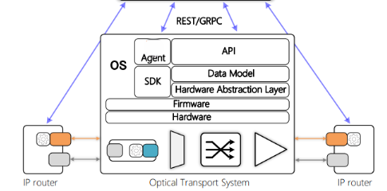

Currently most NOSes running on commercial optical devices are proprietary software. By introducing SONiC support for OTN, the benefits include:

- SONiC has been widely adopted in hyper-scale networks as a white-box switch NOS. With optical support in SONiC, users can have consistent end-to-end network management from the IP layer (switches and routers) to the optical transport layer (OTN devices). This significantly simplifies network management tools and controllers. It also creates the potential for a single SDN controller infrastructure across all layers and enables movement toward an open, converged multi-layer network management solution.
- For optical device vendors, instead of investing the entire effort to develop and maintain a proprietary NOS, existing SONiC NOS infrastructure and generic features, such as user management, security, and management network modules, can be reused. This reduces time to market, improves software quality, and lowers development costs. 
- Joining the SONiC ecosystem also allows vendors and users to collaborate more effectively through the SONiC open-source community.

This document provides a high-level design for extending SONiC to support OTN devices, including YANG models, SAI APIs, orchestration agent changes, Syncd updates, Config DB and APP DB schemas, and other SONiC changes required to bring up a SONiC image on an OTN device.

## 5 Requirements

### 5.1 Functional Requirements

At a high level the following should be supported:

- Bring up SONiC image for a new platform, [otn-kvm](https://github.com/sonic-otn/sonic-buildimage/tree/otn-dev/platform/otn-kvm), and DEVICE_METADATA type - `OtnOls` with a [kvm device](https://github.com/sonic-otn/sonic-buildimage/tree/otn-dev/device/molex/x86_64-otn-kvm_x86_64-r0).
- Bring up SWSS/Syncd containers for switch_type - `otn`
- Able to manage OTN device configured via REST, gNMI client and CLI
- Device Management functions including:
  - Configuration - system (network, ntp, syslog), OTN optical modules.
  - State report - system, OTN optical modules.
  - Chassis management
    - Supervisor card, line card, power module, fan, manufacturing info
    - Operations: restart (warm, cold and power-on), SW/FW upgrade
  - Telemetry: Data streaming for time sensitive state.
  - Alarm notification for system faults.
  - PM statistics counters for important performance parameters.

### 5.2 Scaling Requirements

Following are the scaling requirements: [*TBD*]


| Item          | Expected Max value |
| ------------- | ------------------ |
| Line Cards    | 16                 |
| Optical Ports | 64                 |


### 5.3 Event And Alarm

Alarms listed in the following table should be supported: **[TBD]**


| Alarm name        | Severity |
| ----------------- | -------- |
| OA Loss of Signal | SA       |
| PUS Failed        | NAS      |


### 5.4 PM Counter

Network equipment performance management counters are metrics that monitor and provide insights into the performance of network devices. They help identify potential issues, bottlenecks, and areas for optimization, enabling network administrators to proactively manage and troubleshoot their infrastructure:

For each PM parameter, the following statistics should be available:

- 96 (32) buckets of 15-minute counters including min, max and average.
- 7 buckets of 24-hour counters with min, max and average.

PM parameters listed in the following table should be supported: **[TBD]**


| PM name             | Data Type |
| ------------------- | --------- |
| Chassis Temperature | decimal2  |
| OA1-1 Input Power   | decimal2  |
| Fan-0 Speed         | uint32    |


### 5.5 Telemetry

OTN should support telemetry features. Both [dial-in](https://github.com/sonic-net/sonic-telemetry/blob/master/doc/grpc_telemetry.md) and [dial-out](https://github.com/sonic-net/sonic-telemetry/blob/master/doc/dialout.md) modes should be supported. Telemetry should support the following features:

- STREAM (Streaming Telemetry): Continuously sends updates as data changes. It includes three sub-modes:
  - ON_CHANGE: Sends updates only when the value of the data changes.
  - SAMPLE (Cadence-based): Sends data at a configured periodic interval.
- ONCE: Retrieves the current state of data exactly once and then terminates the subscription.
- POLL: The collector sends a request, and the target sends the current value in response, allowing on-demand data retrieval

Telemetry subscribe paths should support wildcard keys for convenient filtering for NBI clients.

## 6 Architecture Design

This section describes the overall changes needed for supporting OTN devices.

### 6.1 Design Principles

While SONiC is a packet-switch NOS, its modular design and built-in extensibility infrastructure allow developers to add functionality beyond the packet-switching domain.

The following guidelines should be followed while developing a SONiC-based NOS for OTN.

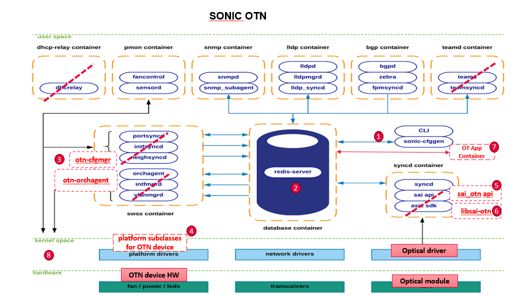

- Fully utilize SONiC's rich extension mechanisms to make changes as seamless as possible, so OTN support becomes an organic part of SONiC.
- Reuse SONiC generic system features as-is, including NBI (REST, CLI, gNMI), telemetry, user management, syslog notifications, SW/FW upgrade, and chassis/PSU/LED/FAN/temperature management.
- Changes for OTN support should be modular and relatively isolated from packet-switching logic, with minimal impact on existing packet-switching functions.
- For major feature gaps, such as PM, alarms, and hot-plug support, enhancements should be designed and implemented generically, not only for OTN.
- All changes should be compatible with the upstream SONiC codebase and ready to merge. The final goal is for all OTN vendors to pull official SONiC code and build SONiC OTN images for their devices.

### 6.2 SONiC Extension Points For OTN Support

The following diagram shows the main changes and SONiC extension points required to support OTN devices:

1. NBI: Add OTN YANG models and support REST API and CLI. OpenConfig [optical transport YANG models](https://github.com/openconfig/public/tree/master/release/models/optical-transport) are adopted.
2. Redis DB: Add new CONFIG, STATE and APP tables for OTN device.
3. SWSS: Add Config manager and Orchagent for OTN device.
4. PMON Drivers: Add user and kernel drivers for Fan, PSU, LED and temperature sensors, FPGA.
5. SAI: Extend SAI to support OTN using SAI experimental extension mechanism.
6. Syncd: driver support for extended OTN SAI attributes.
7. Optical Control: Introduce a new application container, optical-control, which contains multiple daemons for span and wavelength control loops.
8. ONIE: Create an ONIE image for installing the SONiC image on OTN devices; support secure boot.

## 7. SAI API

This section covers the changes made and new APIs added in SAI for implementing this feature.

In SONiC architecture, SAI (Switch Abstraction Interface) is a core interface layer that decouples SONiC control software from vendor-specific hardware implementations. Upper-layer SONiC components (such as Orchagent via the sairedis/syncd path) use standardized SAI object models and APIs, while each vendor provides its own SAI implementation to map those APIs to device SDK/driver operations.

By using SAI as the hardware abstraction boundary, SONiC can keep most control-plane logic hardware-agnostic, improve portability across different platforms, and reduce vendor-specific changes in the SONiC core.

### 7.1 Functional Scope Of SAI For OTN Device

Following the existing SONiC design, SAI is extended to support optical features while generic system functionality remains in the PMON container. This functional division is shown in the following diagram:

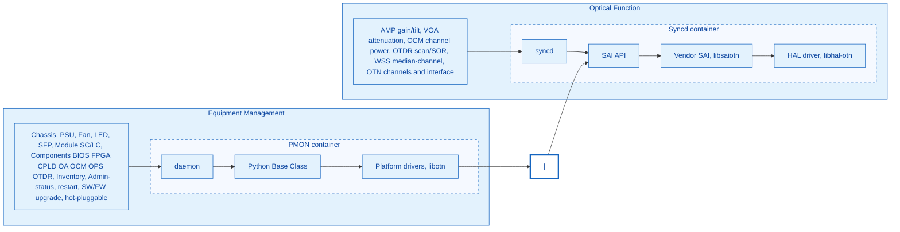


Most OTN devices are chassis-based with control cards and line cards. PMON will be enhanced to support the line card hot-pluggable feature described below.

### 7.2 SAI Experimental Extension Mechanism

While SAI APIs support core packet-switching features, they also include built-in extension mechanisms that allow developers to add new objects and APIs. Here is the [SAI experimental extension design](https://github.com/opencomputeproject/SAI/blob/master/doc/SAI-Extensions.md). The SAI extension mechanism provides:

- Add new attributes, e.g., add new attributes in saiswitchextensions.h.
- Add new API types in saiextension.h.
- Add new object types in saitypesextensions.h.
- Cannot modify existing SAI.
- Add new attributes for the new APIs (e.g., in experimental headers).

### 7.3 OTN Extension To SAI

The SAI extension for OTN devices is proposed [here](./sai_otn_proposal.md).

## 8 SONiC Container Extension For OTN

This section describes changes at SONiC container level to support OTN devices.

### 8.1 OTN Device Metadata And Simulator

In the DEVICE metadata table, a new type, `OtnOls`, and a new `switch_type`, `otn`, are added:

```JSON
"DEVICE_METADATA": {
    "localhost": {
        "type": "OtnOls",
        "switch_type": "otn",
     }
}
```

Before vendors adopt real optical devices using the sonic-otn NOS, a sonic-otn device simulator is developed for feature development and testing. It serves as a vendor-neutral platform for collaboration on sonic-otn as an open source project.

- A new platform is created for [otn-kvm](https://github.com/sonic-otn/sonic-buildimage/tree/otn-dev/platform/otn-kvm) that includes all platform-specific artifacts (config, build rules, and SAI driver code).
- A [new OTN device](https://github.com/sonic-otn/sonic-buildimage/tree/otn-dev/device/molex/x86_64-otn-kvm_x86_64-r0) belonging to otn-kvm is also created for device-specific artifacts. More virtual OTN devices can be added for the otn-kvm platform.
- An open source SAI driver simulator is in a [separate repository](https://github.com/sonic-otn/sonic-otn-libs/tree/main). The simulator's Debian package will be released via the GitHub release mechanism. An example is [here](https://github.com/sonic-otn/sonic-otn-libs/releases/tag/v1.1.0). This follows the same practice that all SONiC SAI drivers from different vendors are not part of the SONiC codebase. At build time, the target platform's SAI driver as a Debian package will be pulled into the SONiC image.

### 8.2 SWSS Extension For OTN Optical Features

Two SONiC built-in containers, SWSS and Syncd, are at the core of data-path control and monitoring, as shown in the following diagram:

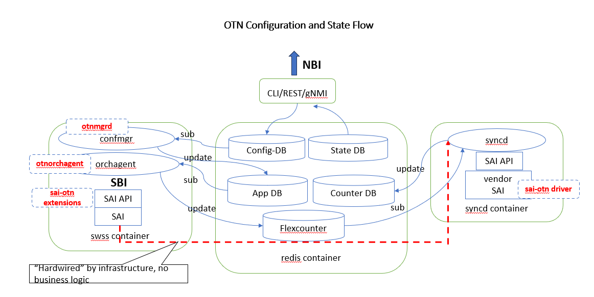

This section describes how SWSS and Syncd support OTN features.

#### 8.2.1 SWSS Config Manager

In the SWSS container, a new config manager daemon, `[otnmgrd](https://github.com/sonic-otn/sonic-swss/blob/otn-dev/cfgmgr/otnmgrd.cpp)`, is created to subscribe to changes in OTN tables in Config DB. When a config change is notified, the OTN config manager updates the corresponding tables in APP DB.

#### 8.2.2 SWSS Orchagent

Orchagent is extended with a [separate folder](https://github.com/sonic-otn/sonic-swss/tree/otn-dev/orchagent/otn) to support OTN devices.

***Switch Object and SAI initialization***

`switch` is the root object for all other SAI objects and must be created during initialization. Orchagent initializes SAI objects based on switch type. SAI initialization is split by switch type: OTN uses the OTN API, while everything else uses the standard SAI API:

- OTN: initOtnApi().
- Non-OTN: existing initSaiApi().

```c++
main.cpp

    if (gMySwitchType == "otn") {
        SWSS_LOG_NOTICE("OTN platform detected, initializing OTN API");
        initOtnApi();
    } else {
        initSaiApi();
    }
```

***OrchDaemon for OTN***

Currently, SONiC supports two types of orch daemons based on `switchType`: `orchDaemon` and `fabricOrchDaemon`. A new type, OTNOrchDaemon, is added to support OTN devices. At runtime, `switchType == otn` is used to determine whether [OtnOrchDaemon](https://github.com/sonic-otn/sonic-swss/blob/otn-dev/orchagent/otn/otnorchdaemon.cpp) should be created. Please see the [code here](https://github.com/sonic-otn/sonic-swss/blob/otn-dev/orchagent/main.cpp).

```c++
    if(gMySwitchType == "otn")
    {
        orchDaemon = make_shared<OtnOrchDaemon>;
    }
    else if (switchType != "fabric")
    {
        orchDaemon = make_shared<OrchDaemon>();
    }
    else
    {
        orchDaemon = make_shared<FabricOrchDaemon>();
    }
```

Creating a new type of OrchDaemon isolates OTN support from the existing logic, resulting in no impact on existing packet features.

#### 8.2.3 Orchagent Superclass (***Common Code Optimization***)

Orchagent performs CRUD operations on SAI objects triggered by APP DB changes. Currently, each SONiC object has its own Orchagent class, which hard-codes APP DB Redis string object-to-SAI attribute mapping in a static table.
Example here in [portsorch.cpp](https://github.com/sonic-net/sonic-swss/blob/master/orchagent/portsorch.cpp).

```c
static map<string, sai_bridge_port_fdb_learning_mode_t> learn_mode_map =
{
    { "drop",  SAI_BRIDGE_PORT_FDB_LEARNING_MODE_DROP },
    { "disable", SAI_BRIDGE_PORT_FDB_LEARNING_MODE_DISABLE },
    { "hardware", SAI_BRIDGE_PORT_FDB_LEARNING_MODE_HW },
    { "cpu_trap", SAI_BRIDGE_PORT_FDB_LEARNING_MODE_CPU_TRAP},
    { "cpu_log", SAI_BRIDGE_PORT_FDB_LEARNING_MODE_CPU_LOG},
    { "notification", SAI_BRIDGE_PORT_FDB_LEARNING_MODE_FDB_NOTIFICATION}
};
```

For OTN devices, a generic superclass, [objectorch](https://github.com/sonic-otn/sonic-swss/blob/otn-dev/orchagent/otn/objectorch.cpp), is defined to support CRUD operations and FlexCounter DB integration. Orchagent classes corresponding to each SAI object can reuse generic methods in `objectorch` for State DB and FlexCounter DB access.

The following `translateObjectAttr(field, value, attr)` resolves the attribute ID from the maps above, normalizes enums and precision-based numbers, and then uses `sai_deserialize_attr_value` with attribute metadata.

```c++
objectorch.cpp

bool ObjectOrch::translateObjectAttr(
    _In_ const std::string &field,
    _In_ const std::string &value,
    _Out_ sai_attribute_t &attr)
{
    if (m_createandsetAttrs.find(field) != ...) attr.id = m_createandsetAttrs[field];
    else if (m_createonlyAttrs.find(field) != ...) attr.id = m_createonlyAttrs[field];
    ...
    auto meta = sai_metadata_get_attr_metadata(m_objectType, attr.id);
    ...
    /* enum map, precision-based float→int, then */
    sai_deserialize_attr_value(newValue, *meta, attr);
    return true;
```

ObjectOrch provides generic Redis-to-SAI object mapping by driving behavior from SAI object/attribute metadata and existing serialize/deserialize helpers. Instead of hard-coding attribute mappings, OTN Orchagent classes, such as OA, OCM, and VOA, inherit `ObjectOrch` for State DB and FlexCounter DB operations. This mechanism eliminates redundant, error-prone mapping code in each individual class. If special handling is needed, individual subclasses can still override superclass functions.

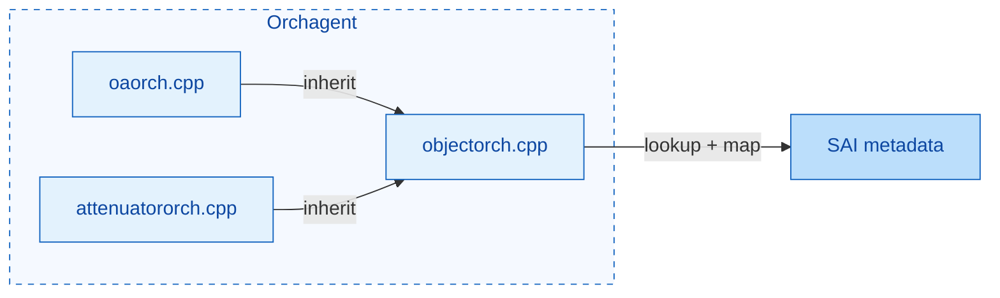

Summary (to be proposed to SONiC community):

- An Orchagent superclass (`ObjectOrch`) is created for generic translation from Redis strings to SAI attributes using SAI metadata, instead of hard-coded mapping tables.
- All Orchagent classes should inherit from `ObjectOrch` and override functions when needed.

### 8.3 OTN State DB Update

This section describes how to support OTN state updates in State DB. Tables in State DB need to be updated continuously so that NBI (CLI/REST API) can read OTN object state—both discrete values (on/off and enabled/disabled, etc.) and gauged values (gain, attenuation and optical power, etc.)—from State DB directly via OpenConfig YANG models. State changes can also be notified via gNMI subscription mechanism.

#### 8.3.1 SONiC SWSS Redis Plug In Script

SWSS utilizes Lua scripts for certain operations, particularly within its Producer/Consumer Table framework. These scripts help in atomically writing and reading messages to and from Redis databases.
Examples of Lua scripts in SWSS can be found in the sonic-swss repository. One notable example is [pfc_restore.lua](https://github.com/sonic-net/sonic-swss/blob/master/orchagent/pfc_restore.lua), which uses Redis commands to handle PFC (Priority Flow Control) restoration.

#### 8.3.2 State DB Update

It is proposed to use SWSS Lua scripts to support State DB updates for a device's real-time status changes. This approach has the following benefits:

- Use the existing Counter DB as-is; no new OTN-specific code is required in Syncd for basic state update.
- SONiC Counter DB is designed for storing raw hardware data. Syncd updates counters specified in the FlexCounter DB. Northbound-visible state can be derived from Counter DB tables.
- Use the existing SWSS Orchagent mechanism to install Lua scripts, similar to stored procedures in traditional database systems. These scripts run inside the Redis container and can be invoked whenever Counter DB is updated.
- These Lua scripts can be device-specific, so each vendor can provide customized scripts as part of device data. This provides maximum flexibility and keeps status updates.

The following diagram shows the workflow of the Redis plug-in script in SONiC.

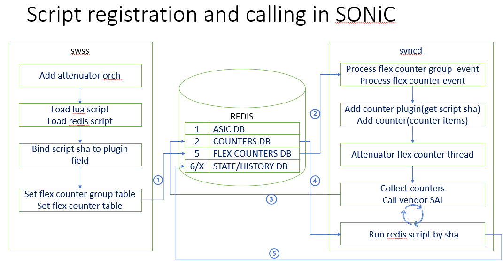

- First, Orchagent installs the script and stores its SHA.
- When Syncd adds the counter attribute, it also adds the plug-in SHA.
- When vendor SAI updates counters, it also sends a request to Redis DB to run the script.

#### 8.3.3 Device Specific Lua Scripts (***Common Code Optimization***)

Currently, some vendor-specific Lua scripts are placed in the SWSS [orchagent](https://github.com/sonic-net/sonic-swss/blob/master/orchagent), which is not ideal:

- Vendor/device-specific scripts are included in the SWSS common codebase.
- Script installation is hard-coded. Only Lua scripts explicitly requested by running code are installed; other files in `/usr/share/swss` are not loaded unless a component is written to load them.

```c++
pfcwdorch.cpp:

    if (this->m_platform == CISCO_8000_PLATFORM_SUBSTRING) {
        restorePluginName = "pfc_restore_" + this->m_platform + ".lua";
    } else {
        restorePluginName = "pfc_restore.lua";
    }
```

For OTN, the script path is under `/usr/share/sonic/platform/<script_path>` (e.g., `otn_oa_plugin.lua`). During SONiC installation, ONIE installs only the scripts for that device. In Orchagent, `loadRedisScript` is used to install all scripts generically into `COUNTERS_DB`, and the returned SHA is passed into the FlexCounter manager.

```c++
objectorch.cpp
    if (!script_path.empty())
    {
        try
        {
            std::string path("/usr/share/sonic/platform/");
            path += script_path;
            std::string att_script = swss::readTextFile(path);
            std::string att_sha = swss::loadRedisScript(m_countersDb.get(), att_script);
            fv_stat = FieldValueTuple(plugin_field, att_sha);
        }
```

Lua scripts are included as part of device configuration; see [example](https://github.com/sonic-otn/sonic-buildimage/tree/otn-dev/device/molex/x86_64-otn-kvm_x86_64-r0).

Summary:

- Device/vendor Lua scripts should be removed from SWSS common code.
- Device/vendor Lua scripts should be part of device configuration.

### 8.4 Syncd Extension

In the Syncd container, SONiC starts the Syncd service at startup, which loads the SAI component (driver) present in the system. This component is provided by various vendors, who implement the SAI interfaces based on their hardware platforms, allowing SONiC to use a unified upper-layer logic to control various hardware platforms. Syncd is responsible for communicating with the Redis database, loading SAI implementation, and interacting with it to handle ASIC initialization, configuration, status reporting, and so on.

For OTN devices, Syncd behavior is similar. However, instead of managing an ASIC, each vendor implements SAI OTN extension APIs to control and monitor OTN objects. Notification handlers are also registered to process events from hardware. OTN support is added by extending logic to process new SAI APIs for OTN objects.

#### 8.4.1 FlexCounter Extension

When a SAI object is created, the corresponding FlexCounter is set up to collect object status in Counter DB. For better code maintainability, instead of modifying the existing [FlexCounter](https://github.com/sonic-net/sonic-sairedis/blob/master/syncd/FlexCounter.cpp), a new file, `[FlexCounterOtn.cpp](https://github.com/sonic-otn/sonic-sairedis/blob/otn-dev/syncd/FlexCounterOtn.cpp)`, is created for OTN support to isolate code maintenance.

`FlexCounter` manages Counter DB configuration for SAI object monitoring. Separate `FlexCounterOtn` files are created for managing OTN SAI object attributes in Counter DB. This reduces code-change contention between the OTN project and the rest of SONiC development.

```Diff
   --- syncd
    |--- FlexCounter.(h|cpp)
+   |--- FlexCounterOtn.(h|cpp)
```

Similarly, SAI Object (de)serialization is also implemented in separate files `meta/sai_serialize_otn` from the main file `sai-serialize`.

***Runtime logical flow isolation***

Processing for OTN SAI objects and APIs is added to existing Syncd infrastructure with clear isolation from existing logic. This is done by placing OTN object processing at the end of current logic, so OTN logic is not in packet-switch code paths. The code snippet for adding the OTN counter plugin is shown below (similar for add/remove counters):

```Diff
FlexCounter.cpp

void FlexCounter::addCounterPlugin {
    ....
    {
            else
            {
+               if (m_flexCounterOtn ->addCounterPlugin(field, shaStrings))
+               {
+                    continue;
+               }

                SWSS_LOG_ERROR("Field is not supported %s", field.c_str());
            }
    }

    // notify thread to start polling
    notifyPoll();
}
```

#### 8.4.2 OTN Gauged Value Modeling

Many OTN objects include floating-point values (e.g., optical power, attenuation, Pre-FEC BER). These values require different levels of precision — optical power may need two decimal places, while Pre-FEC BER may require up to 18. All NBI-facing DBs (Config DB, State DB, Event DB, etc.) should store the gauged value in decimal format.

Currently, SAI supports only `int64_t` statistics, without float/decimal type support. To support float without breaking compatibility, we propose introducing the `@precision` tag, allowing attributes and statistics to specify required precision. Here are examples:

***SAI @precision [0-18] tag***

```c
    /**
     * @brief The actual attenuation applied by the attenuator in units of 0.01dB.
     *
     * @type sai_int32_t
     * @flags READ_ONLY
     * @precision 2
     */
    SAI_OTN_ATTENUATOR_ATTR_ACTUAL_ATTENUATION,
```

In the SAI metadata, the `valueprecision` field in `attrInfo` is used to represent the precision. Code for double to int conversion:

```c
objectorch.cpp
  // Save precision value for each attribute if precision is valid.
  if (attr->valueprecision > 0) {
      m_attrPrecisions[name] = attr->valueprecision;
      m_attrPrecisions[hyphen_name] = attr->valueprecision;
  }

  /* Convert float string to int string according to the precision */
  try
  {
      double float_value = std::stod(value);
      size_t precision = m_attrPrecisions[field];
      int64_t int_value = static_cast<int64_t>(float_value * (std::pow(10, precision)));
      newValue = std::to_string(int_value);
  }
```

***Store read-only gauged value in State DB or Counter DB***

Another design issue is whether to model real-time gauged values in SAI `stat_t` or SAI `attr_t`:

```c

// 1. Realtime gauged value using attr_t

  typedef enum _sai_attenuator_attr_t {
    /**
 * @brief The actual attenuation applied by the attenuator
 * in units of 0.01dB.
 *
 * @type sai_int32_t
 *
 * @flags READ_ONLY
 *
 * @precision 2
 */
       SAI_OTN_ATTENUATOR_ATTR_ACTUAL_ATTENUATION
     }

  // 2. Realtime gauged value using stat_t
  typedef enum _sai_attenuator_stat_t {
    /**
 * @brief The actual attenuation applied by the attenuator
 * in units of 0.01dB.
 *
 * @type sai_int32_t
 *
 * @flags READ_ONLY
 *
 * @precision 2
 */
       SAI_OTN_ATTENUATOR_STAT_ACTUAL_ATTENUATION
  }
```

Based on the following analysis, defining read-only gauged values in `enum_xx_attr_t` seems preferable:

- `stat_t` in current SONiC is all counters (enum), not tagged attributes. Supporting tagged attributes in `stat_t` would require looping through all tags in `SAI/meta/parse.pl`. This introduces major changes and duplicated handling for `stat_t` and `attr_t`.
- Using attr_t for gauged value requires no change to existing SAI parse infrastructure.
- Read-only SAI attributes can be stored in State DB, which is updated by a registered Lua script with a device-specific interval (1 s).

### 8.5 PMON

SONiC PMON (platform monitor) manages generic hardware independent of device function. PMON infrastructure is implemented in two repositories, [sonic-platform-common](https://github.com/sonic-net/sonic-platform-common) and [sonic-platform-daemon](https://github.com/sonic-net/sonic-platform-daemons), described in [this doc](https://github.com/sonic-net/SONiC/blob/master/doc/platform_api/new_platform_api.md). Vendor platform modules reside under `sonic-buildimage/platform` for each device type.

#### 8.5.1 PMON Base Class

Python classes are implemented to model the generic hardware structure and operations on the hardware. Here is the example of a typical device structure in python classes:

- Chassis
  - System EEPROM info
  - Reboot cause
  - Environment sensors
  - Front panel/status LEDs
  - Power supply unit[0 .. p-1]
  - Fan[0 .. f-1]
  - Module[0 .. m-1] (Line card, supervisor card, etc.)
    - Environment sensors
    - Front-panel/status LEDs
    - SFP cage[0 .. s-1]
    - Components[0 .. n-1] (CPLD, FPGA, MCU, ASIC etc.)
      - name
      - description
      - firmware

#### 8.5.2 Device Specific Platform Config And Driver

The JSON file [code here](https://github.com/sonic-otn/sonic-buildimage/blob/otn-dev/device/molex/x86_64-otn-kvm_x86_64-r0/platform.json) defines the OTN device HW hierarchy described above. This config file is device-specific for a particular OTN device, as shown in the following diagram:

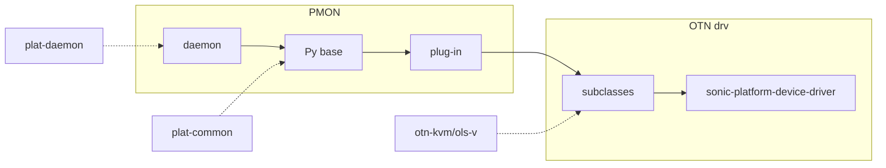


An implementation of the PMON driver is [here](https://github.com/sonic-otn/sonic-buildimage/tree/otn-dev/platform/otn-kvm/sonic-platform-modules-otn-kvm/ols-v). The driver simulator is [here](https://github.com/sonic-otn/sonic-otn-libs).

#### 8.5.3 Linecard Hot Pluggable (***Feature Enhancement***)

Currently, SONiC supports two chassis types:

- Pizza box without pluggable supervisor/control card and line cards
- Multi-ASIC, in which each line card runs an independent SONiC

An OTN device may not fit either architecture above. A typical chassis-based OTN device hosts a control card (supervisor card) and multiple line cards containing various optical modules. When a line card is removed or inserted, Orchagent should be notified so affected objects are removed from or added to the Syncd monitoring thread. Optical component status should also be updated in State DB.

**SONiC *syncd* daemons**

In SWSS and other application containers (for example, BGP and LLDP), various `sync` daemons synchronize state from external sources into Redis (mainly APPL_DB, sometimes STATE_DB). Orchagent (and other SWSS components) then react to that state. In this model, sync daemons publish kernel/config/FPM/peer state to Redis so Orchagent can program the switch.

For OTN devices, line card status changes can be handled in the same way, as shown below:

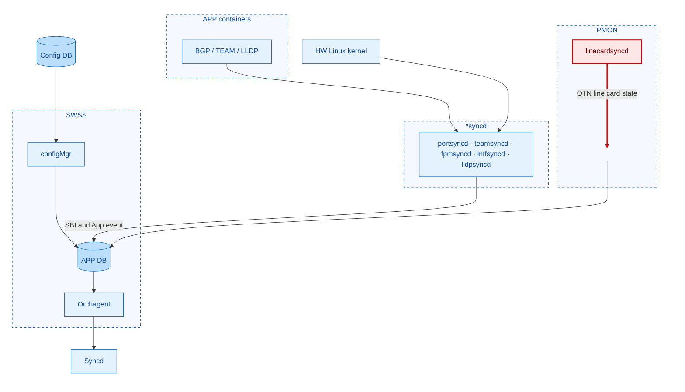


These `*syncd` daemons may run in the SWSS container or in other application containers.

As shown in the flowchart above, new line card sync logic is added to `chassisd` in the PMON container.

The following diagrams show the steps for handling line card insertion or remove/fail events. Note that `linecardsyncd` is implemented as a Python library for each device. The **red** path is **remove only**. The **green** path is when the line card is online (insert / recover).

**Line card down (remove)**

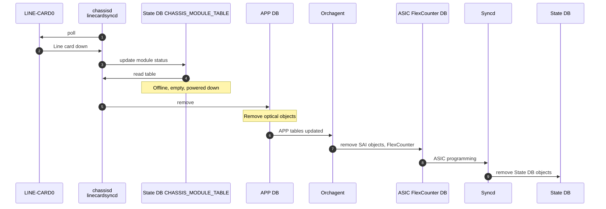


**Line card online (insert / recover)**

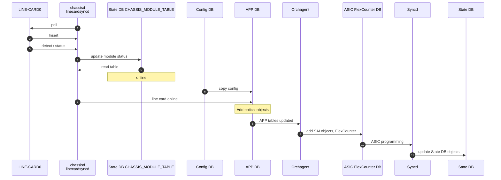

***Line card unplug / failed***

- `chassisd` in PMON detects a removed line card by polling.
- It changes the line card status from online to `empty/fault`.
- The linecardsyncd API (implemented at device level) removes all the optical components on the line card.
- Orchagent is triggered to remove corresponding SAI objects and associated FlexCounter entries.
- Syncd stops monitoring removed resources for these optical modules.
- Objects in State DB should also be removed. NBI queries for these components should return empty results.

***Line card insert/recover***

- PMON detects that a line card is back online (LC communication is OK). 
- It changes the line card status back to online.
- `linecardsyncd` APIs add optical components for the line card by restoring configuration from Config DB.
- Orchagent is triggered to create corresponding SAI objects and associated FlexCounter entries.
- Syncd starts monitoring the resources. State DB should also be updated with current component state.

#### 8.5.4 Firmware Upgrade

SONiC provides a generic mechanism to install/upgrade firmware, [fwutil.md](https://github.com/sonic-net/SONiC/blob/master/doc/fwutil/fwutil.md).

OTN vendors need to implement the Python component APIs defined in the base class `[component_base.py](https://github.com/sonic-net/sonic-platform-common/blob/master/sonic_platform_base/component_base.py)`:

### 8.6 SONiC Host Containers

The following containers shall be enabled in SONiC and included in the image. Switch-specific containers shall be disabled for images built for OTN devices. The SONiC build [rule/config](https://github.com/sonic-net/sonic-buildimage/blob/master/rules/config) must be updated accordingly.


| Container/Feature Name | Is Enabled? |
| ---------------------- | ----------- |
| SNMP                   | Yes         |
| Telemetry              | Yes         |
| LLDP                   | Yes         |
| Syncd                  | Yes         |
| SWSS                   | Yes         |
| Database               | Yes         |
| BGP                    | Yes         |
| Teamd                  | No          |
| PMON                   | Yes         |
| NAT                    | No          |
| sFlow                  | No          |
| DHCP Relay             | No          |
| Radv                   | No          |
| MACsec                 | No          |
| REST API               | Yes         |
| gNMI                   | Yes         |


## 9. Device Configuration And Management

This section contains subsections for all configuration and management-related design topics. Subsections for CLI and Config DB are included below, along with subsections for data models (YANG, REST, gNMI, etc.).

### 9.1. Manifest (If The Feature Is An Application Extension)

N/A

### 9.2. OTN YANG Model

#### 9.2.1 OpenConfig Optical Transport YANG Model

The OTN project adopts the standard OpenConfig YANG model for [optical transport](https://github.com/openconfig/public/tree/master/release/models/optical-transport).


| Object          | Description                       | OpenConfig Reference                      |
| --------------- | --------------------------------- | ----------------------------------------- |
| OA              | Optical amplifier                 | openconfig-optical-amplifier.yang         |
| VOA             | Optical attenuator                | openconfig-optical-attenuator.yang        |
| Optical Port    | Optical transport port            | openconfig-transport-line-common.yang     |
| OCH             | Optical channel                   | openconfig-terminal-device.yang           |
| WSS             | Wavelength selective switch       | openconfig-wavelength-router.yang         |
| OMC             | Optical media channel             | openconfig-wavelength-router.yang         |
| OSC             | Optical supervisory channel       | openconfig-optical-amplifier.yang         |
| OTDR            | Optical time-domain reflectometer | Not defined yet                           |
| OCM             | Optical channel monitor           | openconfig-channel-monitor.yang           |
| APS             | Automatic protection switch       | openconfig-transport-line-protection.yang |
| APS Port        | Automatic protection switch port  | openconfig-transport-line-protection.yang |
| Logical Channel | Logical channel                   | openconfig-terminal-device.yang           |


All Northbound APIs (RESTCONF and gNMI) are based on the above YANG model, as described in the sections below.

#### 9.2.2 Generic Translation And Mapping

As SONiC DBs are implemented using [Redis](https://redis.io/), OpenConfig-based NBIs need to be translated and mapped to/from the Redis DB schema. SONiC management framework infrastructure's Translib converts the data models exposed to management clients into the Redis ABNF schema format. See the HLD [here](https://github.com/sonic-net/SONiC/blob/master/doc/mgmt/Management%20Framework.md).

To support an OpenConfig YANG model:

- Generate the annotation template file:

```bash
goyang --format=annotate --path=/path/to/yang/models openconfig-optical-attenuator.yang > annot/openconfig-optical-attenuator-annot.yang
```

- Annotate YANG extensions to define translation hints. [An example here](https://github.com/sonic-otn/sonic-mgmt-common/blob/otn-dev/models/yang/annotations/openconfig-optical-attenuator-annot.yang).
- Add corresponding SONiC YANG for CVL (configuration verification layer) purposes. [An example](https://github.com/sonic-otn/sonic-mgmt-common/blob/otn-dev/models/yang/sonic/sonic-optical-attenuator.yang).
- Add the list of OpenConfig YANG modules and annotation files to the transformer manifest file, $(SONIC_MGMT_FRAMEWORK)/config/transformer/models_list.
- Implement override methods if you need to translate data with special handling. See the OTN transformer [here](https://github.com/sonic-otn/sonic-mgmt-common/blob/otn-dev/translib/transformer/xfmr_otn_openconfig.go).

See this [developer guide](https://github.com/project-arlo/sonic-mgmt-framework/wiki/Transformer-Developer-Guide) for details.

#### 9.2.3 REST

After the translation and mapping are implemented, the SONiC management framework supports the REST API accordingly. The REST API specification can be auto-generated using the [OpenAPI tool](https://github.com/OpenAPITools/openapi-generator).

OTN REST request examples:

```bash
## Get All Amplifiers
curl -k -X GET\
   "https://127.0.0.1/restconf/data/openconfig-optical-amplifier:optical-amplifier/amplifiers" \
   -H "accept: application/yang-data+json" | jq

# Get One VOA Object
curl -k -X GET \
   "https://127.0.0.1/restconf/data/openconfig-optical-attenuator:optical-attenuator/attenuators/attenuator=VOA0-0" \
   -H "accept: application/yang-data+json" | jq

## Get From Redis Table Directly
curl -k -X GET\
  "https://127.0.0.1/restconf/data/sonic-optical-amplifier:sonic-optical-amplifier/OTN_OA/OTN_OA_LIST" \
  -H "accept: application/yang-data+json" | jq

## Set EDFA Gain
curl -k  -X PUT \
    -H "Content-Type: application/yang-data+json" \
    -H "Accept: application/yang-data+json" \
    "https://127.0.0.1/restconf/data/openconfig-optical-amplifier:optical-amplifier/amplifiers/amplifier=OA0-0/config/target-gain" \
    -d '{"openconfig-optical-amplifier:target-gain": "5.0"}' | jq

## Get A Leaf Node In A Nested List
admin@sonic:~$   curl -k -X GET\
   "https://127.0.0.1/restconf/data/openconfig-channel-monitor:channel-monitors/channel-monitor=OCM0-0/channels/channel=196062500,196137500/state/power" \
   -H "accept: application/yang-data+json" | jq
```

```json
{
  "openconfig-channel-monitor:channel": [
    {
      "state": {
        "target-power": "1.5"
      }
    }
  ]
}

```

#### 9.2.4 gNMI And Telemetry

gNMI set/get/telemetry is supported by [gNMI Server](https://github.com/sonic-net/sonic-gnmi). Design doc is [here](https://github.com/sonic-net/SONiC/blob/master/doc/mgmt/gnmi/SONiC_GNMI_Server_Interface_Design.md).

Again, SONiC has a generic gNMI server implementation to support YANG models backed by Redis DB.

Examples:

```bash
## Get On The Full Attenuator Tree
    gnmic -a 127.0.0.1:8080 -u admin -p YourPaSsWoRd --insecure \
       get --path openconfig-optical-attenuator:optical-attenuator/attenuators

## Get On A Specific Attenuator
    gnmic -a 127.0.0.1:8080 -u admin -p YourPaSsWoRd --insecure \
       get --path openconfig-optical-attenuator:optical-attenuator/attenuators/attenuator[name=VOA0-0]

## gNMI Set On An OTN Resource
gnmic -a 127.0.0.1:8080 \
   -u admin -p YourPaSsWoRd --insecure \
   set \
   --update `openconfig-optical-attenuator:/optical-attenuator/attenuators/attenuator[name=VOA0-0]/   config:::json_ietf:::{
     "openconfig-optical-attenuator:config": {
       "attenuation": "6.0" }
   }`
```

***Path wildcard key support***

One of the most useful gNMI capabilities is subscription support in the following modes:

- once (same as get)
- polling (interval controlled by clients)
- streaming (sample, on change)

OTN clients typically subscribe to **discrete** leaves with **on-change** and **gauged** leaves with **stream** sampling. The sketch below maps those subscriptions to **State DB** (Redis), using the optical attenuator model as an example.

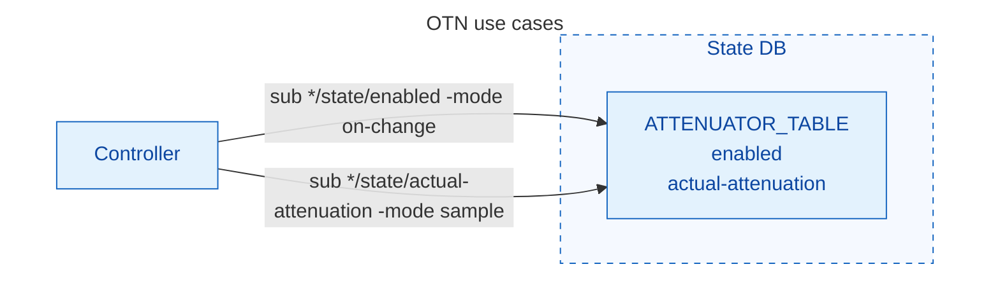


Full path prefix (as in `gnmic`):
 `openconfig-optical-attenuator:optical-attenuator/attenuators/attenuator[name=*]/state/...`.

Here are the examples for telemetry subscription:

```bash
## Sample Mode Wildcard Support:
## 1. In This Mode, The Client Sends A Stream Subscription Request And The Server Pushes Updates At The Default Server Rate. NOTE: The Default Stream Sample Rate Is 20 Seconds.
## 2. Entry Wildcards ([name=*]) You Can Subscribe To All Entries In A List By Using The * Wildcard In The Key Field. This Triggers The Key Transformer To Scan The Appropriate Database—STATE_DB For Dynamic Data Or CONFIG_DB For Settings—and Return Every Discovered Instance.

gnmic   --address 127.0.0.1:8080   --username admin   --password YourPaSsWoRd   --insecure   subscribe   --print-request   --mode stream   --stream-mode sample   --target OC-YANG   --path 'openconfig-optical-attenuator:optical-attenuator/attenuators/attenuator[name=*]/state'

## Path Wildcards (Leaf Node Discovery) By Subscribing To A Parent Container, The Table Transformer Recursively Discovers All Underlying List Members. This Is Useful For Fetching The Entire Hierarchy Of A Device In One Stream.
gnmic --address 127.0.0.1:8080   --username admin   --password YourPaSsWoRd   --insecure   subscribe --mode stream  --stream-mode sample  --target OC-YANG  --path 'openconfig-channel-monitor:channel-monitors/channel-monitor[name=OCM0-0]/channels'

## On Change Mode For Non-Frequent Status Change
gnmic   --address 127.0.0.1:8080   --username admin   --password YourPaSsWoRd   --insecure   subscribe   --print-request   --mode stream   --stream-mode on-change  --target OC-YANG   --path 'openconfig-optical-attenuator:optical-attenuator/attenuators/attenuator[name=*]/state/enabled'

```

As a guideline, 

- For continuously changing optical analog values (power, attenuation, gain, etc.), sampling with an interval (e.g. 5 seconds) should be used.
- For more static status (up/down, enabled/disabled, alarms, and events), on-change mode should be used.

***gNMI Performance Analysis***
A high-performance system is measured in two aspects:

- Response time, for example, 100 ms for all OCM get requests, 100 ms to set all WSS channels' attenuation, etc.
- Data freshness: Counter DB is updated by the Syncd thread periodically and a Lua script then updates State DB accordingly. Therefore, data freshness in State DB depends on the Syncd thread's polling interval, currently 1 second.
- Reasonable resource usage (CPU/RAM)

When the management framework receives a gNMI subscription request, the framework subscribes to changes in the corresponding Redis DB tables, based on the subscription YANG path. 

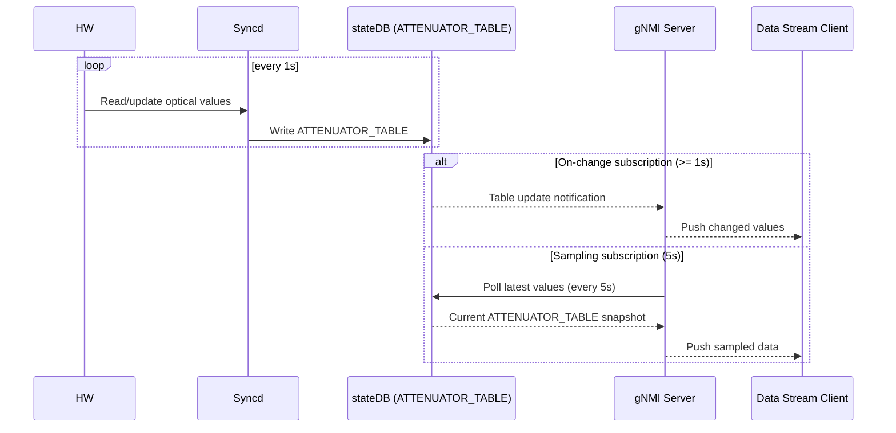

As shown in the diagram above:

- With a wildcard key in the path for gNMI subscription, both on-change and sampled attributes can be stored in the same DB table.
- The Syncd thread polling interval should be finer than the gNMI telemetry interval so that STATE_DB is refreshed more frequently than the telemetry sampling interval and stale data is avoided (for example, Syncd polling at 1 s and gNMI sampling at 5 s).
- SONiC Redis DB subscriptions appear to be table-granular; the gNMI server may therefore be notified of changes about every 1 s.

Performance benchmark tests will be run when a fully functional KVM ILA device (OA, VOA, OCM, WSS/DEG, with 4 line cards) is completed.

#### 9.2.5 CLI Auto Generation For OTN (***Feature Enhancement***)

Most SONiC CLI is implemented in sonic-utilities based on the [Python click library](https://click.palletsprojects.com/en/8.1.x/). These CLIs are supported in [sonic-utilities](https://github.com/sonic-net/sonic-utilities). It is preferred that OTN CLI supports auto-generation instead of hard-coded Python for better maintenance and consistency.

SONiC provides a tool for automatically generating Click CLIs based on SONiC YANG; see [SONiC CLI auto-generation tool](https://github.com/sonic-net/SONiC/blob/master/doc/cli_auto_generation/cli_auto_generation.md). However, the current CLI auto-generation tool only supports CLI show/config on Config DB. A [PR](https://github.com/sonic-net/sonic-utilities/pull/3222) is submitted to enhance the tool to support show in State DB.

***OpenConfig YANG to SONiC YANG translation***
Because `sonic-cli-gen` generates CLI Python code from sonic-yang and OTN uses OpenConfig YANG, [an auto-translation tool](https://github.com/sonic-otn/sonic-buildimage/blob/otn-dev/platform/otn-kvm/sonic-yanggen/sonic_yanggen.py) is developed to translate OpenConfig YANG to SONiC YANG. `sonic_yanggen.py` processes an OpenConfig YANG model and its annotation YANG, which defines the OpenConfig YANG to Redis table mapping. Then a corresponding SONiC YANG module is generated. The generated SONiC YANG is then used to generate CLI by `sonic-cli-gen`, as shown in the following diagram:

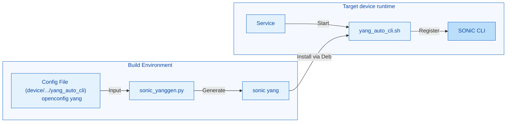


***Device-specific CLI generation***
As each device may have different capabilities and only support a subset of OTN functionality, CLI generation must be device-specific to avoid including unsupported CLI.

- The YANG models supported by a device are configured in device/{vendor}/{platform}/yang_auto_cli to enable generation.

```bash
# Example: device/molex/x86_64-otn-kvm_x86_64-r0/yang_auto_cli
openconfig-optical-attenuator.yang openconfig-optical-attenuator-annot.yang
openconfig-optical-amplifier.yang openconfig-optical-amplifier-annot.yang
```

Here is the workflow:

- At build time:
  - Compiles libyang (and Python bindings) from source.
  - Scans device/ directory for yang_auto_cli config file and converts specified OpenConfig YANG modules and their annotations to SONiC YANG models using sonic_yanggen.py.
  - Packages generated SONiC YANG files into /usr/share/sonic/device-yang/{platform}/.
- At SONiC startup:
  - sonic-yanggen.service runs on startup.
  - Executes yang_auto_cli.sh to register CLI commands. The script only processes files specifically for this `ONIE platform` (ex. x86_64-otn-kvm_x86_64-r0). 
  - As a result, the CLI applicable for that device is generated and available to use.

Note that yang_auto_cli.sh only supports generating CLI for Config DB; [an enhancement PR](https://github.com/sonic-net/sonic-utilities/pull/3222) is submitted to support CLI access to State DB. 

##### Make It A SONiC Feature (***TBD***)

sonic-yanggen is a package that can be used for all devices including packet switches. This package is currently inside of platform/otn/kvm and can be moved to sonic-utilities as a SONiC general package.

***Vertical display support***

Existing sonic-cli-gen displays a Redis table in which each object is in a horizontal format, i.e., a row. This causes an issue when an object has many entries and the data beyond the screen width is truncated. To fix that issue, a vertical option is added for sonic-cli-gen, so that each object will be displayed vertically to show all the attributes. See the following screenshot for the original sonic (horizontal) and improved vertical format. See [this commit](https://github.com/sonic-molex/sonic-utilities/commit/97b19431490e5ca8f151cac7a85ffe6ffba97c99).

```bash
root@sonic:~# show otn-oa-table
NAME   TYPE   TARGET GAIN   MIN GAIN   MAX GAIN   TARGET GAIN TILT   GAIN RANGE       AMP MODE       TARGET OUTPUT POWER   S
----   ----   -----------   --------   --------   ----------------   ----------       --------       -------------------   -
OA0-0  EDFA   12.5          0          25         0.4                FIXED_GAIN_RANGE CONSTANT_GAIN  N/A                   5
OA0-1  EDFA   5.2           5          28         0.5               
root@sonic:~# sonic-cli-gen generate show sonic-optical-amplifier --default-vertical
root@sonic:~# show otn-oa-table
Name ila-east-to-west-amp
   Type                : EDFA
   Target gain         : 17.0dB
   Min gain            : N/A
   Max gain            : N/A
   Target gain tilt    : -1.0dB
   Gain range          : LOW_GAIN_RANGE
   Amp mode            : CONSTANT_GAIN
   Target output power : 23.0dBm
   Max output power    : N/A
   Enabled             : true
   Fiber type profile  : N/A
   Component           : N/A
   Ingress port        : ila-east-to-west-amp-IN
   Egress port         : ila-east-to-west-amp-OUT
   Actual gain         : 17dB
   Actual gain tilt    : -1.02dB
   Input power total   : -4.52dBm
   Input power c band  : -4.52dBm
   Input power l band  : -99.99dBm
   Output power total  : 12.51dBm
   Output power c band : 12.48dBm
   Output power l band : -60dBm
   Laser bias current  : 162.9mA
   Optical return loss : -90dBm

Name ila-west-to-east-amp
   Type                : EDFA
   Target gain         : 17.0dB
   Min gain            : N/A
   Max gain            : N/A
   Target gain tilt    : -1.0dB
   Gain range          : LOW_GAIN_RANGE
   Amp mode            : CONSTANT_GAIN
   Target output power : 23.0dBm
   Max output power    : N/A
   Enabled             : true
   Fiber type profile  : N/A
   Component           : N/A
   Ingress port        : ila-west-to-east-amp-IN
   Egress port         : ila-west-to-east-amp-OUT
   Actual gain         : 17.03dB
   Actual gain tilt    : -0.98dB
   Input power total   : -17dBm
   Input power c band  : -17dBm
   Input power l band  : -99.99dBm
   Output power total  : 0.48dBm
   Output power c band : -0.05dBm
   Output power l band : -60dBm
   Laser bias current  : 85.7mA
   Optical return loss : 14.64dB
```

### 9.3 NBI Configuration Validation

#### 9.3.1 Issue Related To The SONiC Async Configuration

Currently, the SONiC management-framework CVL validates Northbound configuration against the Redis-oriented schema expressed in SONiC YANG, so much of the config written into Redis is checked against those constraints.

This is not enough for some use cases:

- Beyond syntax correctness, configuration can still lack optical-domain business logic checks. For example, if a user sets gain outside the allowed range between min-gain and max-gain, the value may still be stored in Config DB. The OA orchagent or SAI driver may reject it eventually, but it is already present in Config DB, as shown in the following diagram.

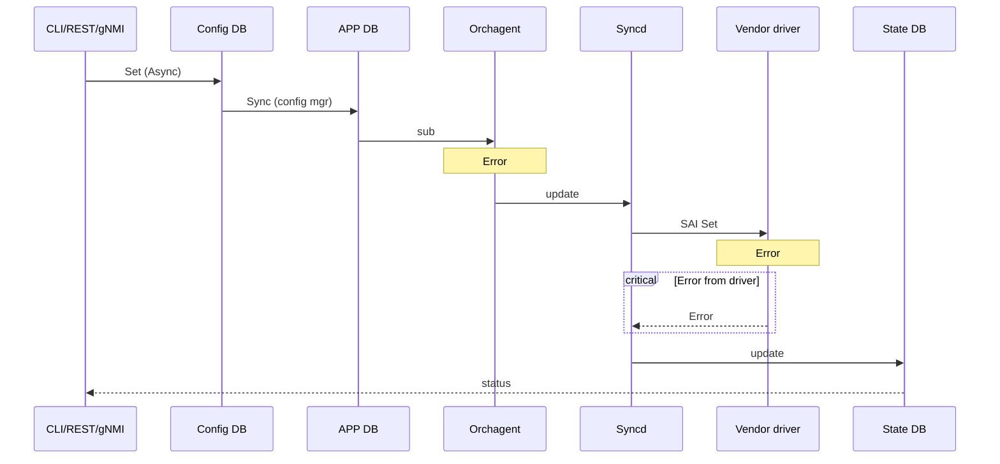


Therefore, it is required that all config data from NBI is fully validated in the NBI front-end (management-framework container) to make sure the config data compiles both syntaxes and also optical device business logic, before update the config DB:

- The config data should be match the Config DB Redis schema. This is supported already in existing SONiC by management-frameworks's CVL feature. CVL validates the config data from NBI against corresponding [sonic yang](https://github.com/sonic-otn/sonic-mgmt-common/tree/otn-dev/models/yang/sonic).
- Sometimes configuration data need to be validated in real-time to make sure it meets the condition of the device at that point of time. This dynamic validation mechanism is also supported by SONiC management framework and described in the next section.
- Additionally, for OTN devices, many configuration parameters have different supported ranges per device type. For example, the valid gain-tilt and target-power etc. are different for different devices type. The device specific rang validation need to be supported. This mechanism is added into SONiC as a new feature described in below section as well.

#### 9.3.2 Runtime Business Logic Validation

SONiC (**sonic-mgmt-common**) supports custom validation of incoming configuration before it is written to Config DB at run time.

- The `**sonic-ext:custom-validation`** extension is defined in [sonic-extension.yang](https://github.com/sonic-net/sonic-mgmt-common/blob/master/models/yang/sonic/common/sonic-extension.yang).

```yang
	extension custom-validation {
		description
			"Extension for custom validation. 
			 Platform specific validation can be implemented using custom validation.";
		argument "handler"; 
	}
```

- Annotate the CVL SONiC YANG with a handler name. For example, in `sonic-mgmt-common/models/yang/sonic/sonic-optical-amplifier.yang`:

```yang
import sonic-extension { prefix sonic-ext; }   // must be in this file, not a deviation

leaf target-gain {
    type decimal64 { fraction-digits 2; }
    sonic-ext:custom-validation "ValidateOtnGain";
}
```

- In `sonic-mgmt-common/cvl/custom_validation`, add the handler implementation (`**ValidateOtnGain**`) with the following signature:

```go
func (t *CustomValidation) ValidateOtnGain(vc *CustValidationCtxt) CVLErrorInfo
```

CVL invokes this method so the **target-gain** value in the NBI (REST/gNMI) request can be checked against **min-gain** and **max-gain** (for example from Config DB or related state).

#### 9.3.3 Device Specific Configuration Value Range Checks (***New Feature***)

On an OTN device, some configuration parameters have ranges that depend on device type. CVL should validate submitted values against those device-specific ranges. For example, gain tilt might be supported in **[-2.0, 0.00]** on one device but differ on another.

The approach is to add a configuration-validation YANG module that augments the default SONiC CVL YANG in the management-framework image, extending the original CVL model with additional range constraints.

- Under the device folder `device/<vendor>/<platform>/cvl-yang`, add `sonic-<platform>-config-validation.yang`, for example:

```c
module sonic-otn-config-validation {
    namespace "http://github.com/Azure/sonic-otn-config-validation";
    prefix "sonic-otn-cv";

    import sonic-optical-amplifier { prefix sopt-amp; }

    revision "2026-04-29" {
        description "Add range constraints to OTN optical amplifier leaves.";
    }

    deviation "/sopt-amp:sonic-optical-amplifier/sopt-amp:OTN_OA/sopt-amp:OTN_OA_LIST/sopt-amp:target-gain-tilt" {
        deviate replace {
            type decimal64 {
                fraction-digits 2;
                range "-2.00..0.00";
            }
        }
    }
}
```

- This yang extension will be build as part of a Debian package in the sonic image and the above yang will be used to generating corresponding yin file and as part of the CVL logic.
- When a user changes the gain-tilt field, CVL ensures the value is within range; otherwise the request is rejected and Config DB is not updated.

The diagram show the complete flow of build time and run time as following:

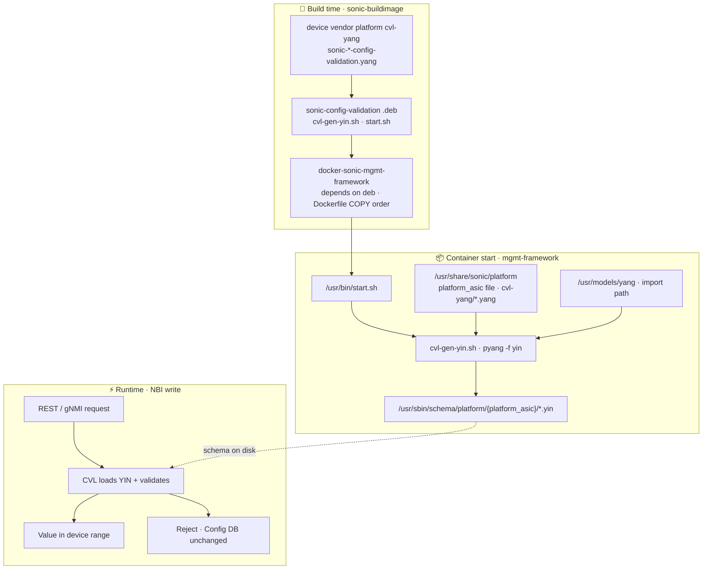


### 9.4 CLI Filtering Mechanism (***New Feature***)

Currently, SONiC has two frameworks for CLI implementation:

- The SONiC CLI can be implemented in **sonic-utilities** using the Python [Click](https://click.palletsprojects.com/en/stable/) library.
- The SONiC Management Framework allows developers to implement CLI (XML, actioner, and renderer) using the [klish](https://src.libcode.org/pkun/klish/src/master) framework.

Because klish-based CLI runs only inside the management-framework container, most CLIs are Click-based and run on the host shell. The OTN CLI auto-generated from the OpenConfig YANG model and its annotations is Click-based as well. Much of the stock SONiC CLI is hard-coded in **sonic-utilities**, with limited ability for each device type to expose only the commands it supports.

##### The Issue

SONiC is designed for data-center switches, so its CLI includes many commands that are irrelevant on OCS/OTN optical platforms. Exposing these commands to operators causes confusion and may lead to misconfigurations.

##### Requirement

For OTN device, as it does not support most CLIs for packet switch, a masking/filtering mechanism is designed, so that each device type can only include the CLIs that it supports.

Platform-specific CLI command filter for SONiC OCS/OTN platforms. Removes unwanted switch-oriented CLI commands (VLAN, VXLAN, NAT, BGP, etc.) from the SONiC `show` / `config` / `clear` CLIs based on a ***per-device*** JSON blacklist.

##### Design

The plugin mechanism in **sonic-utilities** is a Python-based framework that makes the SONiC CLI extensible for third-party features and vendor-specific hardware. The OTN CLI filter uses this mechanism to inject plugins that run after other plugins register commands; the filter then patches Click `Group` objects to hide blacklisted commands at runtime.

###### Lazy Filtering

The filter wraps `click.Group.list_commands` and `click.Group.get_command` rather than deleting command objects. This means commands registered **after** the filter plugin loads are also hidden, as long as they match a blacklist entry.

##### Project Structure

```
sonic-otn-cli-filter/
├── sonic_otn_cli_filter.py            # Core filtering logic
├── plugins/
│   ├── zzz_show_platform_filter.py    # Plugin for "show" CLI
│   ├── zzz_config_platform_filter.py  # Plugin for "config" CLI
│   └── zzz_clear_platform_filter.py   # Plugin for "clear" CLI
├── debian/
│   ├── changelog
│   ├── compat
│   ├── control
│   ├── install
│   ├── postinst                       # Symlinks plugins into sonic-utilities
│   ├── prerm                          # Removes symlinks on uninstall
│   └── rules
└── README.md
```

Device-level configuration file (separate from this package) in sonic-buildimage device directory:

```bash
device/<vendor>/<platform>/cli_unwanted.json
```

##### Workflow

The end-to-end workflow involves **build-time packaging**, **install-time wiring**, and **runtime filtering**.

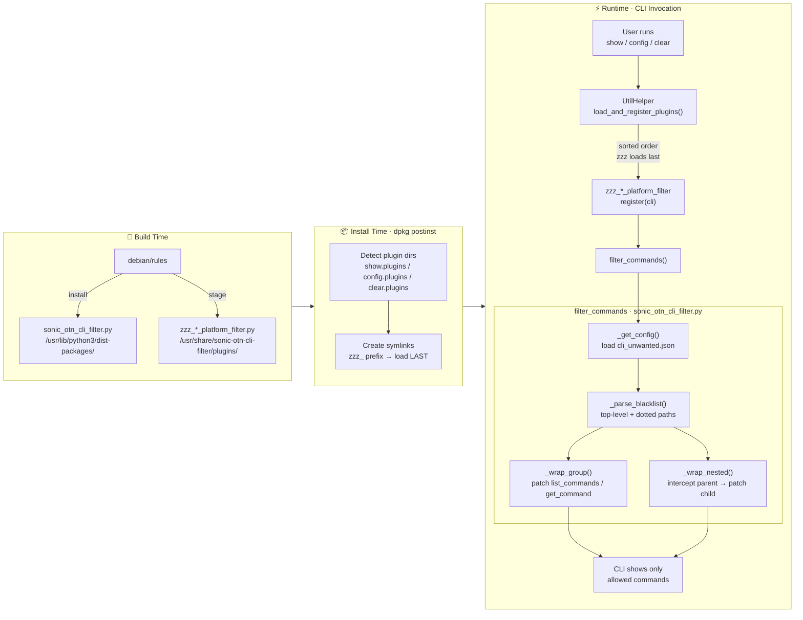


##### Configuration Example — `cli_unwanted.json`

Located at `/usr/share/sonic/device/<platform>/cli_unwanted.json`. Example:

```json
{
    "show": [
        "vlan",
        "vxlan",
        "nat",
        "ip.bgp",
        "ipv6.bgp"
    ],
    "config": [
        "vlan",
        "vxlan",
        "nat"
    ],
    "clear": [
        "nat",
        "watermark"
    ]
}
```

- Top-level entries (`"vlan"`) hide the command directly under the root group.
- Dotted entries (`"ip.bgp"`) hide a sub-command under a parent group — `ip bgp` is hidden while other `ip` sub-commands remain available.

##### Dependencies

- `sonic-utilities-data` (provides the CLI framework and plugin directories)
- `sonic_py_common` (for `device_info.get_platform()` at runtime)

##### Make It A SONiC Feature (***TBD***)

The package is built as a Debian `.deb` and installed via `dpkg` on the OTN KVM platform today. It could be merged into **sonic-utilities** so that all devices, including packet switches, can use it.

### 9.5. Config And State DB Schema For OTN

New Config DB and State DB tables are introduced to support OTN devices. The new DB tables are added in `[schema.h](https://github.com/sonic-otn/sonic-swss-common/blob/otn-dev/common/schema.h)` in `sonic-swss-common`. Potentially, OTN tables can be defined in a separate file (**TBD**).

Config DB and State DB schemas are strictly mapped from OpenConfig YANG models. The following new DB tables are defined for optical amplifiers and variable optical attenuators as examples:

```
CONFIG_DB
=========

OTN_ATTENUATOR
;/openconfig-optical-attenuator:optical-attenuators/attenuator/config
;revision "2019-07-19" {reference "0.1.0"}
key                 = ATTENUATOR|VOA<slot>-<num> ; string, numbers are 0 based.
;field              = value
attenuation-mode    = STRING                 ; identityref    
target-output-power = float64                ; yang decimal64, json Number
attenuation         = float64               
enabled             = "true" / "false"       ; boolean    

OTN_OA
;/openconfig-optical-amplifier:optical-amplifiers/amplifier/config
;revision "2019-12-06" {reference "0.5.0"}
key                 = OTN_OA|OA<slot>-<num>  ; string
;field              = value
type                = STRING                 ; identityref
target-gain         = float64                ; yang decimal64, json Number
max-gain            = float64                ; yang decimal64, json Number
min-gain            = float64                ; yang decimal64, json Number
target-gain-tilt    = float64
gain-range          = STRING                 ; identityref
amp-mode            = STRING                 ; identityref
target-output-power = float64                ; yang decimal64, json Number
max-output-power    = float64                ; yang decimal64, json Number
enabled             = "true" / "false"       ; boolean
fiber-type-profile  = STRING                 ; identityref
autolos             = "true" / "false"       ; oplink extension, APSD
apr-enabled         = "true" / "false"       ; oplink extension 

STATE_DB:
=========
OTN_ATTENUATOR_TABLE
;/openconfig-optical-attenuator:optical-attenuators/attenuator/state
key                 = OTN_ATTENUATOR_TABLE|VOA<slot>-<num>  ; string
;field              = value
attenuation-mode    = STRING                 ; identityref
target-output-power = float64                ; yang decimal64, json Number
attenuation         = float64
enabled             = "true" / "false"       ; boolean

component           = STRING                 ; ref to platform component
ingress-port        = STRING                 ; ref to platform component
egress-port         = STRING                 ; ref to platform component
actual-attenuation  = float64                ; instant value only
output-power-total  = float64
optical-return-loss  = float64

OTN_OA_TABLE
;/openconfig-optical-amplifier:optical-amplifiers/amplifier/state
key                 = OTN_OA_TABLE|OA<slot>-<num>  ; string
;field              = value
type                = STRING                 ; identityref
target-gain         = float64                ; yang decimal64, json Number
max-gain            = float64                ; yang decimal64, json Number
min-gain            = float64                ; yang decimal64, json Number
target-gain-tilt    = float64
gain-range          = STRING                 ; identityref
amp-mode            = STRING                 ; identityref
target-output-power = float64                ; yang decimal64, json Number
max-output-power    = float64                ; yang decimal64, json Number
enabled             = "true" / "false"       ; boolean
fiber-type-profile  = STRING                 ; identityref
autolos             = "true" / "false"       ; oplink extension, APSD
apr-enabled         = "true" / "false"       ; oplink extension

component           = STRING                 ; ref to platform component
ingress-port        = STRING                 ; ref to platform component
egress-port         = STRING                 ; ref to platform component
actual-gain         = float64                ; instant value only
actual-gain-tilt    = float64
input-power-total   = float64
input-power-c-band  = float64
input-power-l-band  = float64
output-power-total   = float64
output-power-c-band = float64
output-power-l-band = float64
laser-bias-current  = float64
optical-return-loss  = float64
```

### 9.6 Event And Alarm Support

#### 9.6.1 SONiC Notification

SONiC has a notification mechanism supporting notifications from Vendor SAI (driver) to SWSS. Currently the notification is only supported by the root SAI object (switch), in which all notification callback attributes and prototypes are defined in `saiswitch.h`. When the switch object is created during SWSS startup, all notification attributes are set with the corresponding callbacks in Orchagent (`main.cpp`). Notification callbacks are defined in `Notification.h|cpp` in Orchagent. When Syncd receives switch creation from Orchagent, it registers its own callbacks to the SAI vendor drivers. When an event is detected by Vendor SAI, the registered Syncd callback will be called with the driver data passed as function parameters. The Syncd callback sends a message via Redis to SWSS Orchagent, which calls the SWSS callback to handle the event.

#### 9.6.2 Notification Extension For OTN

***OTN Notification Extension***
In order to separate OTN notification code from the existing switch code, a notification attribute for OTN is declared in SAI extension `saiswitchextensions.h`. 

```c

/**
 * @brief OTN alarm event notification
 *
 * @count data[count]
 *
 * @param[in] count Number of notifications
 * @param[in] data Array of OTN alarm events
 */
typedef void (*sai_otn_alarm_event_notification_fn)(
        _In_ uint32_t count,
        _In_ const sai_otn_alarm_event_data_t *data);

/**
 * @brief SAI switch attribute extensions.
 *
 * @flags free
 */
typedef enum _sai_switch_attr_extensions_t
{
     ....
     /**
     * @brief OTN alarm event notification callback function passed to the adapter.
     *
     * Use sai_otn_alarm_event_notification_fn as notification function.
     *
     * @type sai_pointer_t sai_otn_alarm_event_notification_fn
     * @flags CREATE_AND_SET
     * @default NULL
     */
    SAI_SWITCH_ATTR_OTN_ALARM_EVENT_NOTIFY,

    SAI_SWITCH_ATTR_EXTENSIONS_RANGE_END

} sai_switch_attr_extensions_t;

```

***OTN Device Object***
Equivalent to the switch's root object. It is proposed to have a logical root object `otndevice` for OTN devices in `saiexperimentalotndevice.h`, as shown in the following diagram:

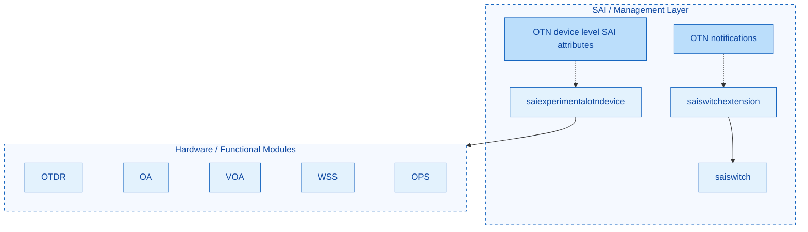


The functionality of the OTN device object includes:

- Manage (config and state) of device-level global properties, such as administrative and operational state, alarm ACT/DEACT timers, etc.
- Register OTN event notification callbacks. This avoids the need for the OTN project to change existing Orchagent `main.cpp` and isolates the new OTN code from the existing switch codebase.

***OTN Event Notification Registration***

OTN event notification reuses the existing SONiC notification mechanism without changing the existing SWSS and Syncd code. The steps are shown in the following diagram:

- During Orchagent startup, when the OTN device object is created, it sets the OTN notification callback in the `saiswitch` object.
- When Syncd receives switch creation from Orchagent, it registers its own callbacks to the SAI vendor drivers.
- When an event is detected by Vendor SAI, the registered Syncd callback will be called with the driver data passed as function parameters.
- The Syncd callback sends a message via Redis to SWSS Orchagent, which calls the SWSS callback to handle the event.
- Currently, the OTN notification handler in SWSS only writes the event to syslog. The extra business logic to process the event is **TBD**.

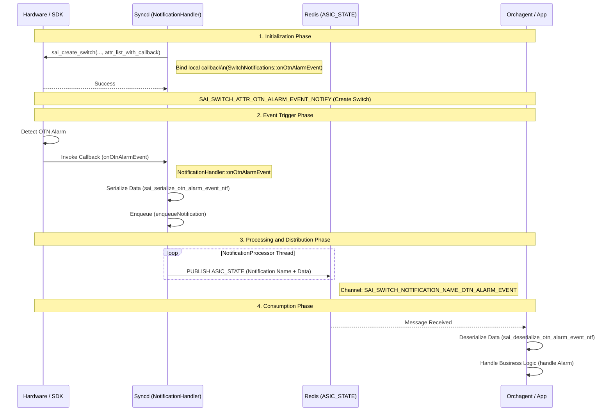


#### 9.6.3 OTN Notification Definition And NBI

***Single Generic Notification for OTN***
As mentioned earlier, SONiC only supports a notification mechanism at the root `switch` object. Therefore it is more efficient to introduce a single generic notification for the OTN device instead of adding many low-level notifications, each of which would require code changes along the existing code path. 

```c
/**
 * @brief OTN alarm event data
 */
typedef struct _sai_otn_alarm_event_data_t
{
    /** OTN object id */
    sai_object_id_t object_id;
    /** OTN event name, string */
    sai_u8_list_t event_name;
    /** OTN event timestamp */
    sai_timespec_t timestamp;
    /** OTN event severity */
    sai_otn_alarm_severity_t severity;
    /** OTN event action */
    sai_otn_alarm_action_t action;
    /** OTN event description, string */
    sai_u8_list_t description;
    /** OTN event binary data payload */
    sai_u8_list_t data;
} sai_otn_alarm_event_data_t;
```

In the top-level notification handler in `otndeviceorch`, further processing at object level can be performed. By translating the object_id to an NBI component name (e.g. OA0-0), the event handler of each object type can be invoked.

***NBI event delivery and retrieval***
There are a few mechanisms to deliver events/alarms to the NBI:

- gNMI subscription (get and on-change)
- syslog notification to management syslog server
- REST and CLI to get current active alarm or alarm history from Event DB.

OTN currently reuses the existing [SONiC event alarm framework](https://github.com/sonic-net/SONiC/blob/master/doc/mgmt/Management%20Framework.md) as is. Note that the [code](https://github.com/sonic-net/sonic-buildimage/pull/22617) has not been merged yet. [Other work](https://github.com/sonic-net/sonic-platform-daemons/pull/421) is ongoing on fault management on top of the event alarm framework.

Upon receiving an event from Syncd, SWSS can notify the event/alarm by

- Writing the event into syslog. Using the event alarm framework syslog plugin mechanism, each OTN device can specify which syslog events should be written to the Event DB. Example [here](https://github.com/sonic-molex/sonic-buildimage/blob/otn-dev/device/molex/x86_64-otn-kvm_x86_64-r0/default.json)
- SWSS OTN notification handler can also write the event to Event DB directly using event alarm framework APIs.

The following sequence diagram shows OTN alarm/event flow from vendor SAI through Orchagent, syslog (SWSS) / rsyslog (host), eventd (eventd-ocs) with default.json (device-specific) mapping, external eventdb (e.g. Redis), to gNMI. Configuration files (`platform.conf`, `platform-regex.json`) are COPY-deployed from the eventd container to the host.

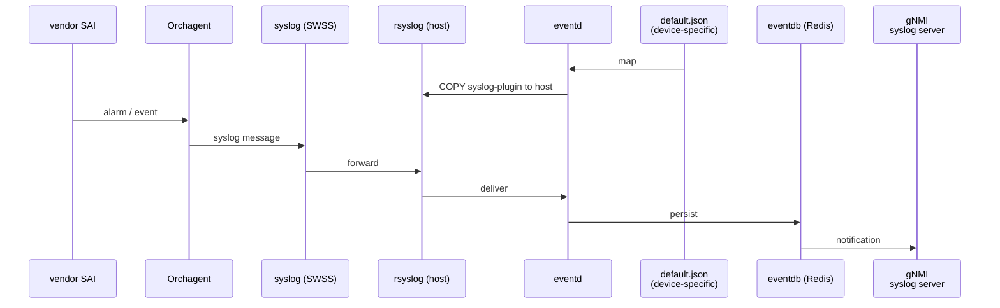


### 9.7 OTN PM Statistics Support (***New Feature***)

This section describes how to support OTN PM statistics counters.

Current SONiC does not support traditional telecom performance management (PM) historical counters.

- 96 (32) buckets of 15-minute counters including min, max and average.
- 7 buckets of 24-hour counters with min, max and average.

#### 9.7.1 PM Design Objective:

- This additional new feature should be modular and not coupled with the current SONiC logic and codebase.
- It should be generic and support all vendors' devices.
- Which PM parameters to collect should be configurable at device level so that each device can specify the PM counter set.

#### 9.7.2 Design Proposal

The first design choice is where the PM mechanism should be hosted. It could be an independent container, or it can run inside the PMON container, which is used more for system monitoring.

Secondly, PM is an application-level feature and should depend on existing data; the status data in State DB tables is an obvious choice.

#### 9.7.3 YANG Model And Redis Schema

Since there is no standard OpenConfig YANG model for PM management, a new SONiC YANG module is defined for PM management.

Please see [sonic-otn-pm.yang](https://github.com/sonic-molex/sonic-buildimage/blob/jimmy/src/sonic-yang-models/yang-models/sonic-otn-pm.yang) (TBD).

The corresponding Redis schema is shown below:

```json
Config DB schema
================
OTN_PM
;Config: which PM parameters to collect per resource type. Key = OTN state table name.
;Each attribute name is a pm-name; the table may have any number of such attributes.
key                 = OTN_PM|resource_type   ; resource_type = OTN state table name (e.g. OTN_OA_TABLE, OTN_ATTENUATOR_TABLE)
;field              = value
;attributes         = 0..n, field name = pm-name (e.g. input-power-total, actual-gain, temperature), value = STRING (e.g. "true" to enable)

// PM configuration example, the configuration is part of device level config
{
  "OTN_PM": {
    "OTN_OA_TABLE": {
      "input-power-total": "true",
      "output-power-total": "true",
      "actual-gain": "true",
      "temperature": "true"
    },
    "OTN_ATTENUATOR_TABLE": {
      "actual-attenuation": "true",
      "input-power-total": "true",
      "output-power-total": "true"
    }
  }
}

State DB schema
===============
OTN_PM_TABLE
;/sonic-otn-pm:sonic-otn-pm/OTN_PM/OTN_PM_LIST
;Performance management: current and historical (15min, 24hour) bins. granularity current uses bin-number 0.
key                 = OTN_PM_TABLE|resource-name|pm-name|granularity|bin-number  ; string
;field              = value
resource-name       = STRING                 ; e.g. OA0-0, Chassis, Fan-0, VOA0-0
pm-name             = STRING                 ; e.g. input-power-total, temperature, actual-gain
granularity         = STRING                 ; enum: current, 15min, 24hour
bin-number          = uint16                 ; 0 for current; 1..96 for 15min; 1..7 for 24hour
min                 = float64                ; minimum in period
max                 = float64                ; maximum in period
avg                 = float64                ; average in period
timestamp           = STRING                 ; for current: start time; for historical: completion time (ISO 8601)
validity            = STRING                 ; enum: valid, invalid, questionable
```

Please note that which parameters to collect is device-specific. Following the SONiC design, configuration files for all devices belonging to a platform are included in the SONiC image; at startup, only those for the specific device are used. 

The following diagram shows how sonic-pm in the PMON container interacts with Config DB, State DB, History DB, and disk for PM configuration, real-time collection, counter updates, and persistence (including restoring PM history from disk into History DB at startup).

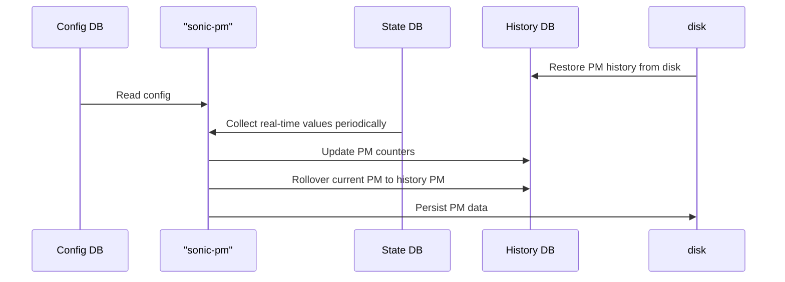

### 9.8 Reuse SONiC Existing Features

SONiC is a mature NOS, which provides most system management features. These features can be used for OTN devices as-is without any changes.

#### 9.8.1 Management And Loopback Interface

OTN devices support at least one DCN interface for device management (NBI).

There are a few alternative ways to configure a static IP address for the management interface.

- Use Click CLI:

```
admin@OTN001:~$ config interface ip add eth0 <ip_addr> <default gateway IP>
```

- Use config_db.json and configure the MGMT_INTERFACE key with the appropriate values. See the config of management interface [here](https://github.com/sonic-net/SONiC/wiki/Configuration#management-interface).
- The same method can be used to configure the Loopback interface address.
  - /sbin/ifconfig lo Linux command shall be used. OR,
  - Add the key LOOPBACK_INTERFACE and value in config_db.json and load it.

Additionally, the management interfaces should support L3 routing protocols, OSPF, and BGP.

#### 9.8.2 TACACS+ AAA

Please see [here](https://github.com/sonic-net/SONiC/blob/master/doc/aaa/TACACS%2B%20Authentication.md).

#### 9.8.3 Syslog

Please see [here](https://github.com/sonic-net/SONiC/blob/master/doc/syslog/syslog-design.md).

#### 9.8.4 NTP

Please see [here](https://github.com/sonic-net/SONiC/blob/master/doc/ntp/ntp-design.md).

#### 9.8.5 SONiC Upgrade

Please see [here](https://github.com/sonic-net/SONiC/wiki/SONiC-to-SONiC-update).

## 10. Warmboot And Fastboot Design Impact

OTN support does not depend on or affect current SONiC warmboot and fastboot behavior. Warm reboot should remain a non-service-affecting (NSA) operation.

## 11. Memory Consumption

In an OTN device, most packet features are not enabled in SWSS (configMgr and Orchagent). Therefore, memory consumption is lower than in a packet switch.

## 12. Restrictions/Limitations

N/A

## 13. Testing Requirements/Design (**TBD**)

### 13.1. Unit Test Cases

### 13.2. System Test Cases

## 14. Open/Action Items If Any

### 14.1 Threshold Management (**TBD**)

Optical modules in device require various thresholds to check signal quality. How do we manage these?